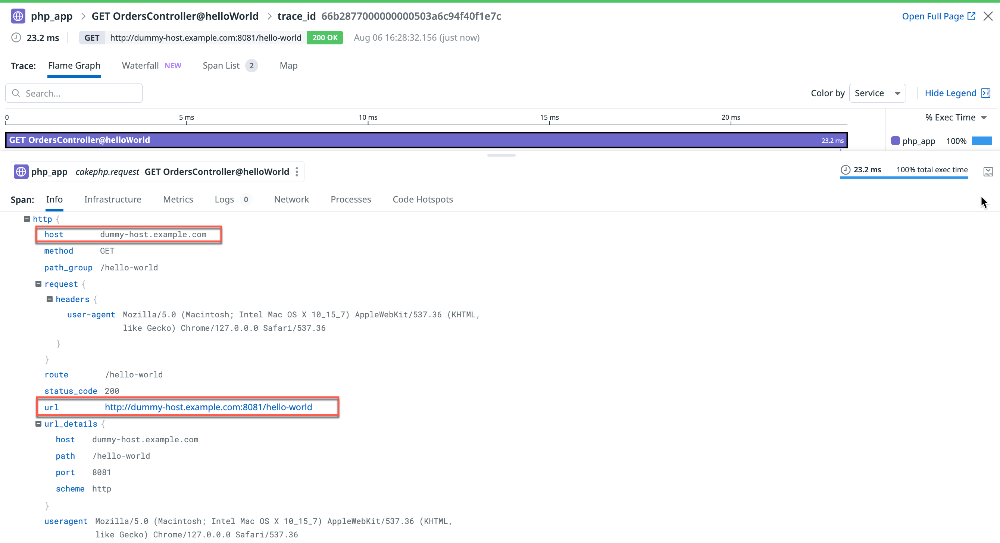

# PHPCake Application

How to change the `ServerName` on a PHPCake5 application running `php:8.2-apache`

# Steps to Change ServerName

1. Configure `my-httpd.conf`

Configure your `my-httpd.conf` in the root directory with the domain of your choice. For example:

```apache
<VirtualHost *:80>
    ServerName dummy-host.example.com
</VirtualHost>
```

2. Start Application and Agent Containers

Start the application and agent with the following with:

```sh
docker-compose build && docker-compose up -d
```

3. Assign `dummy-host.example.com` to your Localhost

Edit your hosts file to assign `dummy-host.example.com` to your localhost:

```sh
sudo nano /etc/hosts
```

Add the following line to the file:

```plaintext
127.0.0.1 dummy-host.example.com
```

Save the configuration by pressing `CTRL + O`, then `ENTER`, and exit by pressing `CTRL + X`.

4. Navigate to Endpoints

Navigate to the following endpoints in your browser:

-   http://localhost:8081/hello-world
-   http://localhost:8081/hello-Order
-   http://localhost:8081/post

# Examples endpoints

1. Hello World

Access the "Hello World" page:
[http://dummy-host.example.com:8081/hello-world](http://dummy-host.example.com:8081/hello-world)



2. Hello Order

Access the "Hello Order" page:
[http://dummy-host.example.com:8081/hello-Order](http://dummy-host.example.com:8081/hello-Order)


3. Posts API

Access the "Posts API" page:
[http://dummy-host.example.com:8081/post](http://dummy-host.example.com:8081/post)


5. Check your Traces

Check your traces, especially the span tag `http.url`, to verify the ServerName was set.
